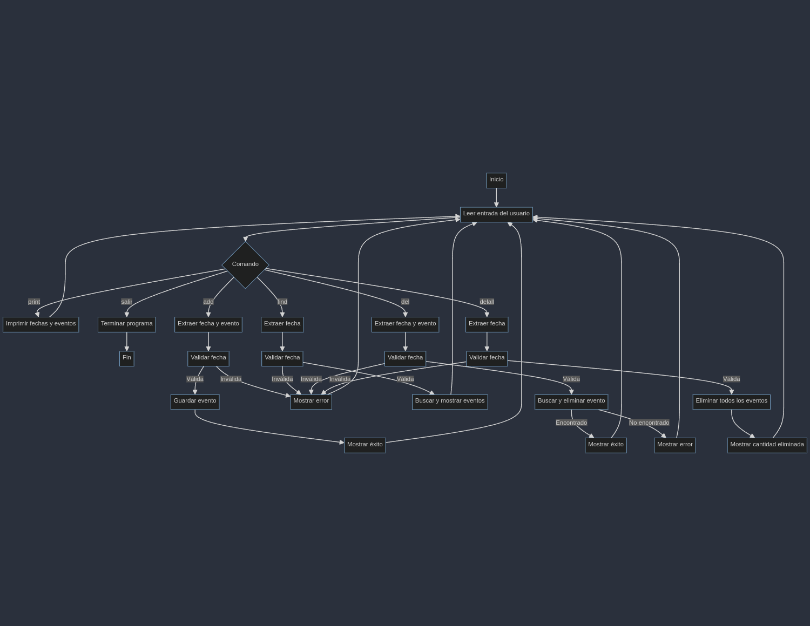

  <h1 align="center">@santiagoabuawad/bd</h1>
<p align="center">
  <h3 align="center">🎓Propuesta</h3>
  Pérdidas, números rojos , mala administración son factores que toda empresa teme. Uno de los generadores de este problema es la mala gestión de información . El mal manejo de esta no solo ralentiza el rendimiento laboral, sino también causa a largo y corto plazo todos estos factores. Es por eso que, como desarrollador, creo que una buena base de datos es esencial para cualquier empresa que quiera destacar en el ámbito laboral. Una base de datos no solo anula todo lo anteriormente mencionado, sino también destaca a la empresa entre otras que no han podido visualizar esta increíble tecnología.
</p> 

  <h3 align="center">📖Tabla Base de datos</h3>
  
| Base de Datos | Tipo          | Sistema de Gestión | Licencia       | Lenguaje de Consulta | Soporte para Transacciones | Escalabilidad           | Modelo de Datos | Soporte para la Nube    |
|---------------|---------------|--------------------|----------------|---------------------|----------------------------|-------------------------|-----------------|-------------------------|
| MySQL         | Relacional    | MySQL              | GPL            | SQL                 | Sí                         | Vertical                | Tablas          | AWS, Azure, Google Cloud|
| PostgreSQL    | Relacional    | PostgreSQL         | PostgreSQL     | SQL                 | Sí                         | Horizontal y Vertical   | Tablas          | AWS, Azure, Google Cloud|
| MongoDB       | No relacional | MongoDB            | SSPL, Apache   | NoSQL               | Limitado                   | Horizontal              | Documentos      | AWS, Azure, Google Cloud|
| Cassandra     | No relacional | Apache Cassandra   | Apache         | NoSQL               | No                         | Horizontal              | Clave-valor     | AWS, Azure, Google Cloud|
| Neo4j         | No relacional | Neo4j              | GPL, Comercial | Cypher              | Sí                         | Horizontal              | Grafo           | AWS, Azure, Google Cloud|


Estas son las tecnologias mas conocidas en el sector de las bases de datos aqui tenemos sus caracterisitcas y una compracion al respecto.


<h3 align="center">🔎Justificacion </h3>

</p>

**Almacenamiento de información** Permiten almacenar grandes cantidades de información organizada de manera que se puede acceder, gestionar y actualizar eficientemente.
**Toma de decisiones** La información organizada en una base de datos puede ser utilizada para análisis y toma de decisiones estratégicas, ayudando a las empresas a comprender mejor sus operaciones, clientes y mercados.
**Eficiencia operacional** Automatizan y simplifican muchos procesos, reduciendo errores humanos y aumentando la eficiencia.
**Soporte para aplicaciones de negocios** Las bases de datos son la columna vertebral de muchas aplicaciones empresariales como sistemas de planificación de recursos empresariales (ERP) y gestión de relaciones con clientes (CRM).


<h3 align="center">🐢 Estructura Repositorio</h3>

  ```css
proyecto
│   ├── funct-call.h
│   ├── funct.cpp
│   ├── main.cpp
│   ├── struct.h
│   ├── bd-diagrama.png
  ```
<h4 align="center">Estructura</h2>

  ```cpp
  struct Fecha {
    int anio;
    int mes;
    int dia;
};
  ```

<h4 align="center">Funciones</h2>
<details>
<summary>Validar Fecha</summary>
  
  ```cpp
bool validarFecha(int anio, int mes, int dia) {
    if(anio == 0) {
        cout << "Year value is invalid: " << anio << endl;
        return false;
    }
    if(mes < 1 || mes > 12 )
    {
        cout << "Month value is invalid: "<< mes << endl;
        return false;
    }
    if (dia < 1 || dia > 31) 
    {
        cout << "Day value is invalid: "<<dia<<endl;
        return false;
    }
    if(mes == 2) 
    {
        if(dia > 29)
        {
            cout << "Day value is invalid: "<< dia << endl;
            return false;
        }
    }
    else if(mes == 4 || mes == 6 || mes == 9 || mes == 11) 
    {
        if(dia > 30) {
            cout << "Day value is invalid: "<< dia << endl;
            return false;
        }
    }
    return true;
}
```

Basicamente mediante una funcion booleana dentro de funcionan agrego filtros en forma de sentencias que permiten detectar si una fecha no es valida es decir su formato es erroneo
</details>

<details>
<summary>Contar Guiones</summary>

  ```cpp
int contarGuiones(const string& str) {
    int count = 0;
    for (char c : str) {
        if (c == '-') {
            count++;
        }
    }
    return count;
}
```

Esta funcion me permite asegurarme que la fecha siga el formato year-moth-day
</details>

<details>
<summary>formatearFecha</summary>

  ```cpp
string formatearFecha(int anio, int mes, int dia) {
    return to_string(anio) + "-" + (mes < 10 ? "0" : "") + to_string(mes) + "-" + (dia < 10 ? "0" : "") + to_string(dia);
}
```

Esta funcion me permite agregar los 0 que faltan a la fecha
</details>

<details>
  <summary>insertarEventoEnOrden</summary>

  ```cpp
void insertarEventoEnOrden(vector<string>& eventos, const string& evento) {
    auto it = eventos.begin();
    while (it != eventos.end() && *it < evento) {
        ++it;
    }
    if(it == eventos.end() || *it != evento) {
        eventos.insert(it,evento);
    }
}
```

Con esto ordeno los eventos en orden acendente como es requerido
</details>

<details>
  <summary>imprimirFechas</summary>

  ```cpp
void imprimirFechas(const map<string, vector<string>>& fechas) {
    for (const auto& par : fechas) {
        cout << "Fecha: " << par.first << endl;
        for (const auto& evento : par.second) {
            cout << "  - " << evento << endl;
        }
        cout << "-----------------------------------" << endl;
    }
}
```

Con esta funcion muestro las fechas en consola
</details>

<details>
<summary>eliminarEvento</summary>

  ```cpp
bool eliminarEvento(vector<string>& eventos, const string& evento) {
    for (auto it = eventos.begin(); it != eventos.end(); ++it) {
        if (*it == evento) {
            eventos.erase(it);
            return true;
        }
    }
    return false;
}
```

esta funcion de tipo booleana me permite eliminar los eventos la uso para los comandos de eliminacion
</details>


<h3 align="center">🌲Diagrama de flujo </h3>

Aqui podemos ver la estructura primitiva del programa como mediante sentencias logramos filtrar las entradas
y almacenar los eventos en la fecha deseade

<h3 align="center">🥪Funcionando</h3>
<p align="center">
    
</p>


<h3 align="center">👤Creditos </h3>

<p align="center">
  
  <br>
  <strong style="font-size: 24px;">Santiago Abuawad</strong>
</p>


<h3 align="center">🔧Tecnologias</h3>
<div >
	<table>
		<tr>
			<td><code></code></td>
			<td><code></code></td>
			<td><code></code></td>
		</tr>
	</table>
</div>

